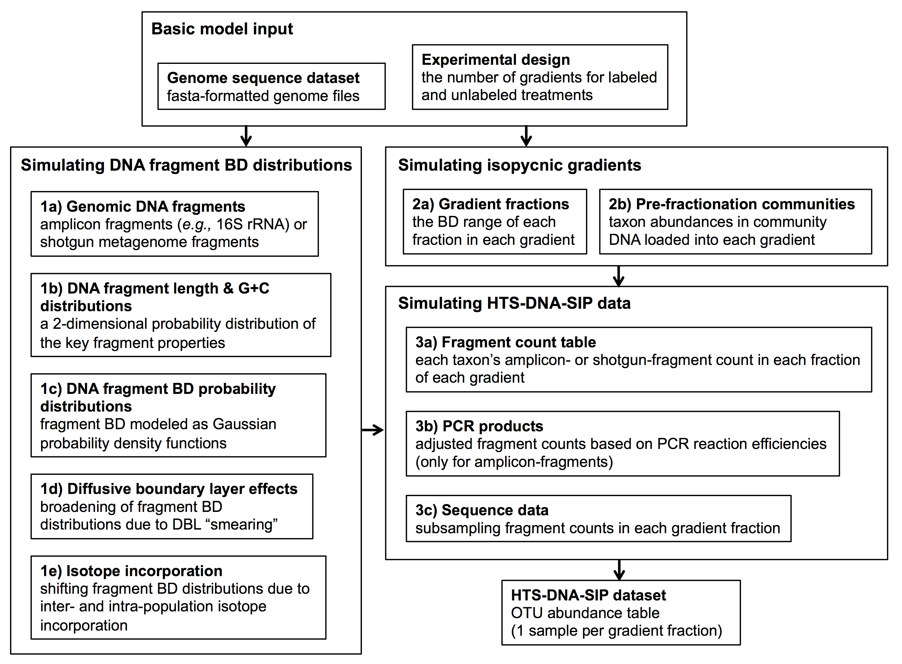

SIPSim
======
SIPSim is a toolset for simulating data from high resolution 
stable isotope probing (HR-SIP) experiments.

#### Sections

- [REFERENCE](#reference)
- [INSTALLATION](#installation)
- [TUTORIALS](#tutorials)
- [SIULATION WORKFLOW](#simulation workflow)
- [CHANGE LOG](#changelog)
- [LICENSE](#license)

# REFERENCE

[[top](#sections)]

If you use SIPSim, please cite:

> Youngblut, ND, Buckley DH. Evaluating the accuracy of DNA stable isotope probing. doi: https://doi.org/10.1101/138719

# INSTALLATION

[[top](#sections)]

## DEPENENCIES

### Python

See setup.py for a list of python package dependences.

### Other

* [MFEprimer_linux](https://github.com/nick-youngblut/MFEprimer_linux)
  * This is a modified version of [MFEprimer-2.0](https://github.com/quwubin/MFEprimer)
    * It has been modified for installation into a linux environment via `python setup.py install`

### Dependency install issues (using Anaconda)

* scipy libgrfortran issues
  * See https://github.com/ilastik/ilastik-build-conda/issues/17
* scipy MKL issues
  * See https://github.com/BVLC/caffe/issues/3884
  * MKL can be shut down. See [this blog post](https://www.continuum.io/blog/developer-blog/anaconda-25-release-now-mkl-optimizations)
    * This can be done by: `conda install nomkl`
    
## Installation of SIPSim

### Clone the repo

~~~
git clone https:github.com/nyoungb2/SIPSim.git
cd SIPSim
~~~

### Compile C code; set up paths; add bash completion

~~~
python setup.py build
python setup.py install --prefix=~
echo 'source '`pwd`'/sourceMe' >> ~/.bashrc
~~~

## Installation of SIPSimR

[SIPSimR](https://github.com/nick-youngblut/SIPSimR) contains R scripts for data
analysis and plotting of data produced by SIPSim. See the README for more information.

# TUTORIALS

[[top](#sections)]

* [An example with 3 genomes](./ipynb/example/1_dataset.ipynb)
* [Recreating Fig 1 from Lueders et al., 2004](./ipynb/example/Lueders2004.ipynb)

# SIULATION WORKFLOW

[[top](#sections)]

# CHANGELOG

[[top](#sections)]

# LICENSE

[[top](#sections)]

* Free software: MIT license